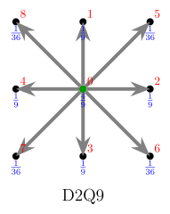
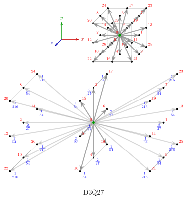

I used the TikZ package in $\LaTeX$ to draw diagrams for Lattice-Boltzmann Method (LBM) algorithms.

Here is my work.

## D2Q9 Model

## D3Q27 Model

---

The diagrams can be regenerated by compiling the corresponding `.tex` files in the `./d2q9/` and `./d3q27/` directories. The resulting `.pdf` files can then be converted to `.svg` format. I recommend using `pymupdf` for this conversion, as demonstrated in my script [here](https://github.com/Xuanyiyiren/Intersting-things/blob/main/pdf2svg/pdf2svg.py).

The main work was done with the assistance of GPT-5 in Copilot.

`d2q9labelcode.py` and `d3q27labelcode.py` are examples of how to utilize the label definitions in your own code.

Feel free to use these diagrams in your work.